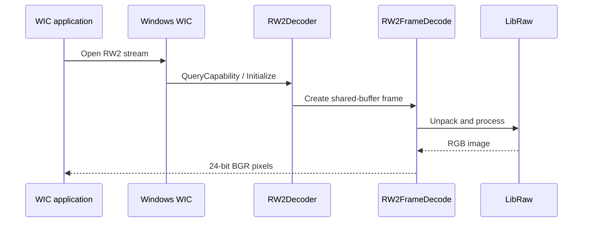

# Project structure

RW2 WIC Codec is a Windows x64 in-process COM server implementing a WIC bitmap decoder for Panasonic RW2 files.

## Directory map

```text
.
├── .github/
│   ├── ISSUE_TEMPLATE/          # Structured bug and feature reports
│   ├── workflows/
│   │   ├── ci.yml               # Push/PR Debug and Release validation
│   │   └── release.yml          # Tagged installer and ZIP publishing
│   ├── dependabot.yml
│   └── PULL_REQUEST_TEMPLATE.md
├── include/
│   ├── ClassFactory.h
│   ├── Common.h
│   ├── RW2Decoder.h
│   ├── RW2FrameDecode.h
│   └── RW2MetadataQueryReader.h
├── src/
│   ├── ClassFactory.cpp
│   ├── DllMain.cpp
│   ├── Guids.cpp
│   ├── Registration.cpp
│   ├── RW2Decoder.cpp
│   ├── RW2FrameDecode.cpp
│   ├── RW2MetadataQueryReader.cpp
│   └── Utils.cpp
├── tests/
│   ├── TestDecoder.cpp
│   ├── TestExif.cpp
│   └── TestPerf.cpp
├── scripts/
│   ├── install.bat
│   └── uninstall.bat
├── CMakeLists.txt
├── RW2Codec.def
├── RW2Codec_Setup.iss
└── vcpkg.json
```

Generated DLLs, executables, symbols, build directories, and camera samples are intentionally excluded from source control.

## Component responsibilities

| Component | Responsibility |
| --- | --- |
| `DllMain.cpp` | Module lifetime and exported COM entry points |
| `ClassFactory.cpp` | `IClassFactory` implementation |
| `RW2Decoder.cpp` | Stream validation, frame creation, decoder metadata, preview access |
| `RW2FrameDecode.cpp` | LibRaw processing and WIC pixel copying |
| `RW2MetadataQueryReader.cpp` | WIC metadata query paths and PROPVARIANT conversion |
| `Registration.cpp` | WIC decoder, CLSID, file type, and pattern registration |
| `Utils.cpp` | Thread-safe loading of codec-local runtime DLLs |
| `Guids.cpp` | Decoder and vendor GUID definitions |

## Data flow



## Build and test boundaries

- CMake builds the codec and three diagnostics.
- CTest runs no-sample smoke tests in CI.
- Full WIC decoding and EXIF checks require a registered codec and an RW2 file.
- Release packaging copies the codec, LibRaw runtime dependencies, and registration scripts into an installer and ZIP.

## Version sources

Release preparation must update these files together:

- `CMakeLists.txt`
- `RW2Codec_Setup.iss`
- the registered version in `src/Registration.cpp`
- `vcpkg.json`
- `RELEASE_NOTES.md`
- `CHANGELOG.md`

The current version is 1.1.10.
