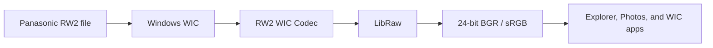

# RW2 WIC Codec

Native Panasonic RW2 support for Windows

[](https://github.com/magnum-qin/RW2-WIC-Codec/actions/workflows/ci.yml)
[](https://github.com/magnum-qin/RW2-WIC-Codec/releases/latest)
[](https://github.com/magnum-qin/RW2-WIC-Codec/releases)
[](LICENSE)


**English** · [简体中文](README_CN.md) · [日本語](README_JA.md)

RW2 WIC Codec is a 64-bit Windows Imaging Component decoder for Panasonic `.rw2` RAW files. Once installed, compatible files can be decoded by Windows File Explorer, Windows Photos, and other applications that use WIC.

[Download the latest release](https://github.com/magnum-qin/RW2-WIC-Codec/releases/latest) · [Report a bug](https://github.com/magnum-qin/RW2-WIC-Codec/issues/new?template=bug_report.yml) · [Read the troubleshooting guide](TROUBLESHOOTING.md)

## What it provides

- System-wide WIC decoding for Panasonic RW2 files
- Windows Explorer thumbnails and previews
- Windows Photos and WIC-compatible application support
- Camera white balance, sRGB output, and PPG demosaicing through LibRaw
- Embedded JPEG preview retrieval through `IWICBitmapDecoder::GetPreview`
- EXIF access through `IWICMetadataQueryReader`, including camera, exposure, ISO, focal length, capture time, orientation, and dimensions
- Shared RAW buffers to avoid unnecessary decoder-to-frame copies
- Local, thread-safe loading of LibRaw and its runtime dependencies
- Exception barriers at COM boundaries to reduce the impact of malformed input



## Requirements and compatibility

| Item | Requirement |
| --- | --- |
| Operating system | Windows 10 or Windows 11 |
| Architecture | x64 only |
| Installation | Administrator privileges |
| Source build | Visual Studio 2022, CMake 3.15+, vcpkg |
| Runtime backend | LibRaw |

Compatibility ultimately depends on the LibRaw version bundled with a release and the exact camera/firmware combination. If a file fails, include the camera model and LibRaw-related error output in the bug report.

## Install

### Installer

1. Open the [latest release](https://github.com/magnum-qin/RW2-WIC-Codec/releases/latest).
2. Download `RW2Codec_Setup_v*.exe`.
3. Run the installer and approve the administrator prompt.
4. Restart File Explorer or Windows if thumbnails do not refresh immediately.

Release installers are not currently code-signed, so Windows SmartScreen may display a warning. Verify that the file came from this repository's Releases page and compare the SHA-256 digest shown by GitHub before running it.

### Portable package

Download `RW2Codec-v*-x64.zip`, extract all files into one permanent directory, and run `install.bat` as administrator. Keep the codec and its dependency DLLs together after registration.

### Uninstall

Use Windows Apps settings for an installer-based installation. For the portable package, run `uninstall.bat` as administrator before deleting the extracted directory.

## Build from source

Install Visual Studio 2022 with **Desktop development with C++**, CMake, and vcpkg. Then run:

```batch
vcpkg install --triplet x64-windows
cmake -S . -B build -A x64 ^
  -DCMAKE_TOOLCHAIN_FILE="%VCPKG_ROOT%\scripts\buildsystems\vcpkg.cmake" ^
  -DBUILD_TESTING=ON
cmake --build build --config Release
ctest --test-dir build -C Release --output-on-failure
```

The repository also provides `setup_and_build.bat` for an interactive Windows setup. See [BUILD_GUIDE_CN.md](BUILD_GUIDE_CN.md) for the detailed Chinese build guide.

## Test with an RW2 file

The automated CTest suite verifies that the diagnostic executables start correctly. Full decoding remains an integration test because it requires a registered codec and a real RW2 sample.

```batch
TestDecoder.exe C:\Photos\sample.rw2
TestExif.exe C:\Photos\sample.rw2
TestPerf.exe C:\Photos\sample.rw2
```

- `TestDecoder` decodes through WIC and writes a BMP for visual inspection.
- `TestExif` prints selected EXIF values exposed through WIC.
- `TestPerf` compares LibRaw demosaicing modes; its output is a local diagnostic, not a published benchmark.

Do not upload an RW2 sample publicly before checking it for location, serial-number, author, or other sensitive metadata.

## Repository layout

```text
.
├── .github/                 # CI, release workflow, and contribution templates
├── include/                 # COM and WIC declarations
├── src/                     # Codec, registration, metadata, and loader implementation
├── tests/                   # Diagnostic and smoke-test executables
├── scripts/                 # Portable install and uninstall scripts
├── CMakeLists.txt           # Build and CTest configuration
├── vcpkg.json               # LibRaw dependency manifest
└── RW2Codec_Setup.iss       # Inno Setup installer definition
```

See [PROJECT_STRUCTURE.md](PROJECT_STRUCTURE.md) for component details.

## Documentation

| Document | Purpose |
| --- | --- |
| [BUILD_GUIDE_CN.md](BUILD_GUIDE_CN.md) | Detailed Chinese build guide |
| [TROUBLESHOOTING.md](TROUBLESHOOTING.md) | Build, installation, and runtime troubleshooting |
| [CHANGELOG.md](CHANGELOG.md) | Version history |
| [RELEASE_NOTES.md](RELEASE_NOTES.md) | Notes for the current release |
| [CONTRIBUTING.md](CONTRIBUTING.md) | Development and pull-request workflow |
| [SECURITY.md](SECURITY.md) | Private vulnerability reporting |
| [SUPPORT.md](SUPPORT.md) | Support scope and diagnostic checklist |

## Contributing

Bug reports, camera compatibility reports, documentation fixes, and focused pull requests are welcome. Read [CONTRIBUTING.md](CONTRIBUTING.md) and the [Code of Conduct](CODE_OF_CONDUCT.md) first.

## License

The project source is licensed under the [MIT License](LICENSE). LibRaw is distributed under LGPL 2.1 or CDDL 1.0; see [THIRD_PARTY_NOTICES.md](THIRD_PARTY_NOTICES.md) before redistributing binaries.

LibRaw and Windows Imaging Component are trademarks or projects of their respective owners.
