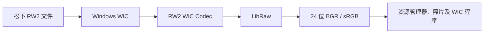

# RW2 WIC Codec

让 Windows 原生读取松下 RW2 文件

[](https://github.com/magnum-qin/RW2-WIC-Codec/actions/workflows/ci.yml)
[](https://github.com/magnum-qin/RW2-WIC-Codec/releases/latest)
[](https://github.com/magnum-qin/RW2-WIC-Codec/releases)
[](LICENSE)


[English](README.md) · **简体中文** · [日本語](README_JA.md)

RW2 WIC Codec 是一个面向 64 位 Windows 的 Windows Imaging Component 解码器。安装后，Windows 资源管理器、Windows 照片以及其他使用 WIC 的程序可以直接解码兼容的松下 `.rw2` RAW 文件。

[下载最新版](https://github.com/magnum-qin/RW2-WIC-Codec/releases/latest) · [报告问题](https://github.com/magnum-qin/RW2-WIC-Codec/issues/new?template=bug_report.yml) · [故障排查](TROUBLESHOOTING.md)

## 主要功能

- 为松下 RW2 文件提供系统级 WIC 解码
- 资源管理器缩略图和预览
- Windows 照片及其他 WIC 程序支持
- 基于 LibRaw 的相机白平衡、sRGB 输出和 PPG 插值
- 通过 `IWICBitmapDecoder::GetPreview` 读取内嵌 JPEG 预览
- 通过 `IWICMetadataQueryReader` 读取相机、曝光、ISO、焦距、拍摄时间、方向和尺寸等 EXIF 信息
- 共享 RAW 缓冲区，减少解码器与帧对象之间的数据复制
- 在 Codec 所在目录中线程安全地加载 LibRaw 及其依赖
- 在 COM 边界拦截 C++ 异常，降低损坏文件影响宿主程序的风险



## 系统要求与兼容性

| 项目 | 要求 |
| --- | --- |
| 操作系统 | Windows 10 或 Windows 11 |
| 架构 | 仅支持 x64 |
| 安装权限 | 需要管理员权限 |
| 源码构建 | Visual Studio 2022、CMake 3.15+、vcpkg |
| 解码后端 | LibRaw |

具体相机兼容性取决于 Release 中附带的 LibRaw 版本以及相机、固件组合。如果文件无法打开，请在问题报告中提供相机型号和相关错误输出。

## 安装

### 使用安装程序

1. 打开[最新 Release](https://github.com/magnum-qin/RW2-WIC-Codec/releases/latest)。
2. 下载 `RW2Codec_Setup_v*.exe`。
3. 运行安装程序并允许管理员权限。
4. 如果缩略图没有立即刷新，请重启资源管理器或 Windows。

当前发布的安装程序尚未进行代码签名，因此 Windows SmartScreen 可能显示警告。请只从本仓库 Releases 页面下载，并在运行前核对 GitHub 提供的 SHA-256 摘要。

### 使用便携压缩包

下载 `RW2Codec-v*-x64.zip`，将所有文件解压到一个长期保留的目录，然后以管理员身份运行 `install.bat`。注册后不要单独移动 Codec 或依赖 DLL。

### 卸载

使用安装程序安装时，从 Windows“已安装的应用”中卸载。使用便携包时，先以管理员身份运行 `uninstall.bat`，再删除文件目录。

## 从源码构建

安装 Visual Studio 2022 的“使用 C++ 的桌面开发”组件、CMake 和 vcpkg，然后运行：

```batch
vcpkg install --triplet x64-windows
cmake -S . -B build -A x64 ^
  -DCMAKE_TOOLCHAIN_FILE="%VCPKG_ROOT%\scripts\buildsystems\vcpkg.cmake" ^
  -DBUILD_TESTING=ON
cmake --build build --config Release
ctest --test-dir build -C Release --output-on-failure
```

也可以运行交互式脚本 `setup_and_build.bat`。完整说明参见 [BUILD_GUIDE_CN.md](BUILD_GUIDE_CN.md)。

## 使用 RW2 文件验证

自动 CTest 只验证诊断程序能否正常启动。完整解码属于集成测试，需要已注册的 Codec 和真实 RW2 样本。

```batch
TestDecoder.exe C:\Photos\sample.rw2
TestExif.exe C:\Photos\sample.rw2
TestPerf.exe C:\Photos\sample.rw2
```

- `TestDecoder` 通过 WIC 解码并输出 BMP，供人工对比。
- `TestExif` 输出 WIC 暴露的部分 EXIF 信息。
- `TestPerf` 比较 LibRaw 插值模式，仅用于本机诊断，不代表正式性能基准。

公开上传 RW2 样本前，请先检查其中是否包含位置、相机序列号、作者等敏感元数据。

## 仓库结构

```text
.
├── .github/                 # CI、发布流程和社区模板
├── include/                 # COM 与 WIC 接口声明
├── src/                     # 解码、注册、元数据和依赖加载实现
├── tests/                   # 诊断程序与烟雾测试
├── scripts/                 # 便携安装和卸载脚本
├── CMakeLists.txt           # 构建与 CTest 配置
├── vcpkg.json               # LibRaw 依赖清单
└── RW2Codec_Setup.iss       # Inno Setup 安装程序
```

组件说明参见 [PROJECT_STRUCTURE.md](PROJECT_STRUCTURE.md)。

## 文档

| 文档 | 用途 |
| --- | --- |
| [BUILD_GUIDE_CN.md](BUILD_GUIDE_CN.md) | 完整构建指南 |
| [TROUBLESHOOTING.md](TROUBLESHOOTING.md) | 构建、安装及运行故障排查 |
| [CHANGELOG.md](CHANGELOG.md) | 版本历史 |
| [RELEASE_NOTES.md](RELEASE_NOTES.md) | 当前版本发行说明 |
| [CONTRIBUTING.md](CONTRIBUTING.md) | 开发与 Pull Request 流程 |
| [SECURITY.md](SECURITY.md) | 私密报告安全漏洞 |
| [SUPPORT.md](SUPPORT.md) | 支持范围与诊断清单 |

## 贡献与许可

欢迎提交缺陷报告、相机兼容性反馈、文档改进和目标明确的 Pull Request。开始前请阅读 [CONTRIBUTING.md](CONTRIBUTING.md) 和[行为准则](CODE_OF_CONDUCT.md)。

项目源代码采用 [MIT License](LICENSE)。LibRaw 采用 LGPL 2.1 或 CDDL 1.0；重新分发二进制前请阅读 [THIRD_PARTY_NOTICES.md](THIRD_PARTY_NOTICES.md)。
